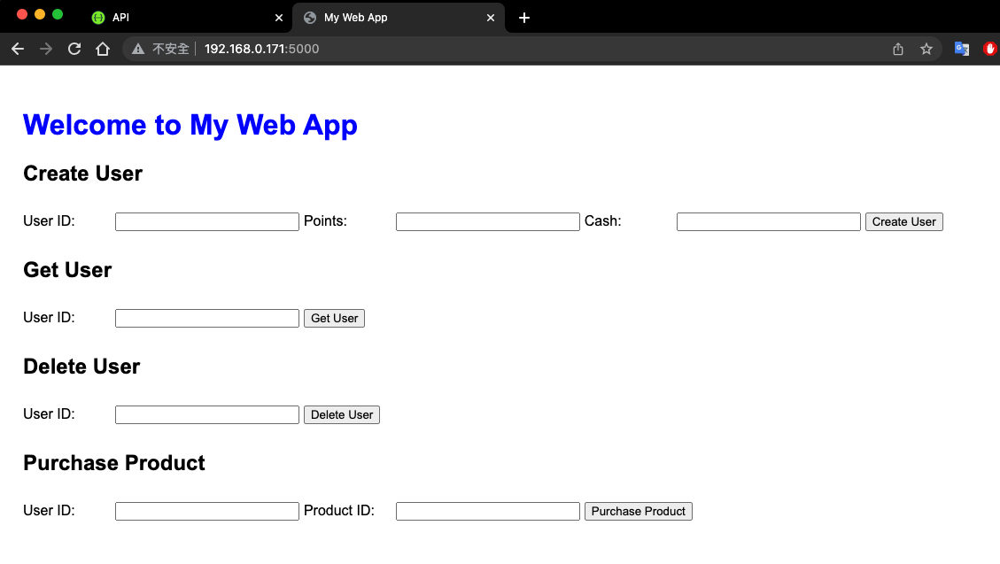
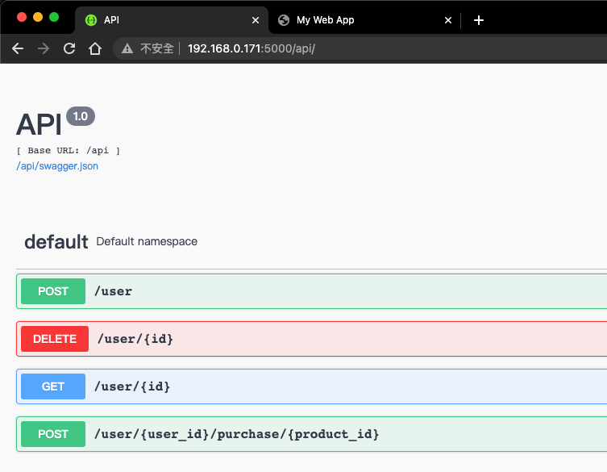

# Interview Side Project

### Introduce
The main purpose of this project is to showcase fundamental abilities that backend web developers will use, such as Python, Flask, SQL, blueprints, MVC architecture, containers, and Docker Compose. The basic functionalities of this project will be introduced below.
 
#### Platform functionalities describe.
1. Create users and verify their cash and point balances.
2. Delete users.
3. Get the current user's point and cash balances.
4. Users can purchase or redeem points.Regarding the purchase of goods by users, there are two forms:
    4-1. Some products can only be purchased with cash and cannot be redeemed, and after purchasing each item, there will be reward points given.
    4-2. Some products can only be redeemed and cannot be purchased with cash. 
    Below is products example.
    ```
    id, name, price, redeem, can_be_exchanged
    ('A', 'Product A', 1000, 5, 0),
    ('B', 'Product B', 2000, 3, 0),
    ('C', 'Product C', 4000, 8, 0),
    ('D', 'Product D', 1200, 5, 0),
    ('E', 'Product E', 0, 10, 1),
    ('F', 'Product F', 0, 20, 1);

    can_be_exchanged item: When value is 0, it means the product can only be bought; when the value is 1, it means the product can only be exchanged.
    Example: Jacky has 1000 redeem points and 5000 cash. He buys Product A. The result will show that Jacky has 1005 redeem points and 4000 cash. When Jacky exchanges for Product E, the returned value will be 995 redeem points and 4000 cash.
    ```

### Project file structure.
```
.
├── docker-compose.yml
├── Dockerfile
├── init.sql
├── myapp
│   ├── controllers.py
│   ├── frontend
│   │   ├── static
│   │   │   ├── main.js
│   │   │   └── style.css
│   │   └── templates
│   │       └── index.html
│   ├── __init__.py
│   ├── models.py
│   └── views.py
├── README.md
├── requirements.txt
└── run.py
```
* docker-compose.yml: The YAML configuration file for defining and managing Docker services.
* Dockerfile: The file used to build the Docker image for the project.
* init.sql: An SQL script containing the initial database schema or data.
* myapp/controllers.py: File defining the controllers or handlers for the application's business logic.
* myapp/frontend/static/main.js: JavaScript file responsible for the main functionality of the frontend.
* myapp/frontend/static/style.css: CSS file that defines the styles for the frontend.
* myapp/frontend/templates/index.html: Main HTML template for the application's frontend.
* myapp/init.py: Initialization file for the "myapp" package.
* myapp/models.py: File defining the data models or database schema for the application.
* myapp/views.py: File defining the views or endpoints for the application's web interface.
* README.md: Markdown file containing information and instructions about the project.
* requirements.txt: File listing the project's dependencies or required packages.
* run.py: Main Python file used to start or run the application.

### Set up enviroment

#### Step 1
First of all, you need to check if you have the Docker Compose and Docker packages installed. If you don't have the packages, please follow the commands below.
```
$ sudo apt update
$ sudo apt install docker.io
$ sudo systemctl start docker
$ sudo systemctl enable docker
$ sudo docker --version
$ sudo apt install docker-compose
$ sudo docker-compose --version
```

#### Step 2
```
$ cd [to this project]

# Please wait a moment during this step as the system will download the packages and set up the database.
$ sudo docker-compose up --build
```

#### Step 3
Go to your browser and type your server's IP address. You will be able to see the frontend page, which will look like the figure below.
```
$ http://[your_server_ip]:5000/
```

The product setting like below
```
id, name, price, redeem, can_be_exchanged
('A', 'Product A', 1000, 5, 0),
('B', 'Product B', 2000, 3, 0),
('C', 'Product C', 4000, 8, 0),
('D', 'Product D', 1200, 5, 0),
('E', 'Product E', 0, 10, 1),
('F', 'Product F', 0, 20, 1);
```

#### Step 4
If you want to use Swagger to check the API, you can type the following URL.
```
$ http://[your_server_ip]:5000/api/
```



#### Step 5
If you want close service just Control + C.
And double check the servie was down.
```
$ sudo docker-compose down
```